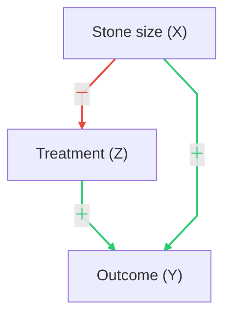

# W01 0901

## Course Info

- **Instructor:** Shu-Chin Lin ([scllin@ntu.edu.tw](mailto:scllin@ntu.edu.tw))
- **Location:** Room F402 — Monday, 9:10 AM–12:10 PM
- **Office Hours:** Tuesday, 3:00 PM–5:00 PM（次震宇宙館 605 室）

## Grading

- **Homework (30%)**: Late submissions incur a 20% deduction per day.
  - 【2周出一次，两周内繳交，題目從課本習題出】
- **Midterm Exam (30%)**: Oct 27, 2025; closed book, no cheat sheet.
- **Final Project (40%)**: Details TBA.
  - 用資料集去做分析（大部分數據都不可能得出因果的結論）
  - assign paper, re-produce
    - 靠GPT寫code太容易出錯了。
    - re-produce有多困難，連小數點最後一位都要準確，幫助理解每一個細節
    - 不然，基礎概念沒有搞清，自己寫論文，simulation根本就錯，最後才全盤推翻，太慘了。

## References

- Ding, P. (2024). _A First Course in Causal Inference_. Chapman and Hall/CRC. [Link](https://sites.google.com/site/pengdingpku/papers?authuser=0)

## Course Outline

- Randomized experiments and randomization-based inference
- Unconfounded observational studies
- Sensitivity analysis in confounded observational studies
- Instrumental variables, with focus on Mendelian randomization

## Prerequisites

- Basic probability, statistics, regression

## Causality in Philosophy

> "I would rather discover one causal law than be King of Persia." — Democritus  
> "We do not have knowledge of a thing until we grasped its cause." — Aristotle  
> 「欲知前世因，今生受者是；欲知來世果，今生做者是」—《三世因果經》

## Notes

- 大家必修微積分，有些人到數學系去修高等微積分，後來發現微積分也不會變厲害
- 或者分析，也是一樣，不是為了微積分的計算，而是為了後面的推廣而做出基礎
- 這門課是為了統計所的學生設計的
- 嚴格定義出 causal 的符號、關鍵的假設是什麼
- 上的課是做基礎化的工作

## 各個領域的「因果」
### 哲學上的因果
### 統計上的因果
- 例子：吸煙與肺癌？空氣污染與肺癌？
- 嘗試下結論時需區分「因果」與「關聯」：例如直覺上可能想說空氣污染導致肺癌，但往往最多只能說有關聯（association）。
- 我們的學習目標之一，是在下結論時更謹慎。
- 有些主題，僅有關聯就足夠（例如 prediction/預測）。
- 著名行銷案例：尿布與啤酒關聯用於提高銷量；在此關聯已足夠實用。

### 觀察性研究 vs. 實驗：維他命 E 與 CHD

- 1993（觀察性研究）：維他命 E 攝取與冠心病（CHD）風險下降呈相關。刊出後許多人因此補充，廠商亦大量宣傳。
- 2004（雙盲隨機對照試驗 RCT；Eidelkman）：補充維他命 E 與 CHD 風險下降「沒有關係」。

### Confounders in Observational Studies

- Confounders (e.g., age, smoking, diet...) are variables that affect both the treatment (e.g., Vitamin E) and the outcome (e.g., CHD).
- Confounding (or common cause) is the main complication/hurdle between association and causation.
- Directed Acyclic Graphs (DAGs) are used to represent these relationships.
- Confounders can lead to bias.

#### Variables and Coding (Kidney Stone example)
- `X` — stone size: `1 = small`, `0 = large`
- `Z` — treatment: `1 = Treatment A`, `0 = Treatment B`
- `Y` — outcome: `1 = success`, `0 = failure`
- DAG intuition: `Z <- X -> Y` (stone size confounds the A/B–>success relationship)

### Simpson's Paradox

#### Setup
- Two treatments: A, B
- Outcome: Y ∈ {1: success, 0: failure}
- Potential confounder/stratum: S （例：結石大小 Small/Large）

#### Aggregated (unstratified) 2×2

|            | Y=1 (success) | Y=0 (failure) | Total |
|------------|----------------|---------------|-------|
| Treatment A | 273 | 77 | 350 |
| Treatment B | 289 | 61 | 350 |

- Success rate (overall):
  - r_A = 273 / 350 = 0.780 = 78.0%
  - r_B = 289 / 350 = 0.826 ≈ 82.6%

#### Stratified by S

| Stratum S | Treatment | Y=1 (succ) | Y=0 (fail) | Total | Rate `r_{t|S}` |
|-----------|-----------|------------|------------|-------|--------------|
| Small     | A         | 81         | 6          | 87    | `81/87 = 0.931 ≈ 93.1%` |
| Small     | B         | 234        | 36         | 270   | `234/270 = 0.867 ≈ 86.7%` |
| Large     | A         | 192        | 71         | 263   | `192/263 = 0.730 ≈ 73.0%` |
| Large     | B         | 55         | 25         | 80    | `55/80 = 0.688 ≈ 68.8%` |

- Success rate within stratum s:
  - r_{A|S=s} = succ_{A,s} / n_{A,s}
  - r_{B|S=s} = succ_{B,s} / n_{B,s}

#### How Simpson's paradox appears
- Within each stratum: r_{A|S=Small} > r_{B|S=Small} and r_{A|S=Large} > r_{B|S=Large}
- But overall (aggregated): r_A < r_B due to imbalance in S across treatments. Here: 78.0% < 82.6% while A > B in both strata.
- Typical cause: different case-mix (e.g., A used more on severe cases).

#### Which treatment is better?
- Compare within homogeneous strata (conditioning on S). If A dominates B in both strata, prefer A.
- Avoid using the aggregated r_A vs. r_B when S is an important prognostic factor and imbalanced between A/B.
- If S is not fully observed, consider design/analysis fixes: randomization, matching, weighting, regression adjustment, IV, or sensitivity analysis.

#### Quick checklist
- Identify plausible confounders S.
- Check balance of S across A/B (n_{A,s} vs. n_{B,s}).
- Compare stratum-specific rates r_{A|S=s} vs. r_{B|S=s}.
- Only aggregate after ensuring appropriate adjustment for S.

#### UC Berkeley Admissions (Bickel et al., 1975)

Aggregated (Departments A + F):

|        | Accept (Y=1) | Reject (Y=0) | Total | Rate |
|--------|---------------|--------------|-------|------|
| Male   | 534           | 664          | 1,198 | 534/1,198 = 0.446 ≈ 44.6% |
| Female | 113           | 336          | 449   | 113/449 = 0.252 ≈ 25.2%  |

- Note: Female rejects = 19 + 317 = 336 (from dept totals).

By department:

Dept A

|        | Accept (Y=1) | Reject (Y=0) | Total | Rate |
|--------|---------------|--------------|-------|------|
| Male   | 512           | 313          | 825   | 512/825 = 0.621 ≈ 62.1% |
| Female | 89            | 19           | 108   | 89/108 = 0.824 ≈ 82.4%  |

Dept F

|        | Accept (Y=1) | Reject (Y=0) | Total | Rate |
|--------|---------------|--------------|-------|------|
| Male   | 22            | 351          | 373   | 22/373 = 0.059 ≈ 5.9%  |
| Female | 24            | 317          | 341   | 24/341 = 0.070 ≈ 7.0%  |

Interpretation (Simpson's paradox):
- Within each department A and F, females have higher acceptance rates than males.
- Aggregated over A+F, males have a higher acceptance rate than females.
- Reason: Composition imbalance — a larger share of female applicants apply to the highly selective Dept F:
  - Male composition: A 825/1,198 = 68.9%, F 373/1,198 = 31.1%
  - Female composition: A 108/449 = 24.1%, F 341/449 = 75.9%

#### Variables and Coding (Berkeley example)

- Departments (`X`): 1 = Dept A, 0 = Dept F
- Gender (`Z`): 1 = female, 0 = male
- Outcome (`Y`): 1 = accept, 0 = reject
- Question: Is department the confounder?

#### Berkeley DAG

> 不是 department 去影響性別，而是性別影響自己選擇何種專業。  
> X = Department 不是 confounder，而是 mediator（中介因子）。  
> Simpson's paradox 並不只出現在有 confounder 的情況，背後可能有不同的機制、可能性。不只是數理上的，其實需要更多背景知識。

---

### 補充說明

目前因果推論的教材尚未統一，不像微積分那樣統一。參考教材時需特別小心，甚至連 Wikipedia 上的內容有時也會出現錯誤，閱讀後反而可能更加混淆。

**原則上，請以我們課堂指定的課本為主。**

---

### Simpson's Paradox 動畫示例

---

這門課，與其說是統計技術上的精進，不如說是，觀念上，或是有機會參與一些研究的時候，最初收集資料的時候，可以提出一些建議，有利於之後的分析。

---
## Frameworks for Causal Inference

How can we build a model or framework complex enough to formalize basic intuitions about cause and effect?  
Two commonly used frameworks are:

---

### 1. The Potential Outcome Framework

- **又稱**：counterfactual framework，或 Neyman-Rubin Causal Model（Neyman, 1923; Rubin, 1974）
- **核心概念**：每個單位（人、物件等）在不同處置（treatment）下，都有一組潛在結果（potential outcomes），但實際上只能觀察到其中一個（即「反事實」無法同時觀察）。
- **重點**：比較「如果接受處置」與「如果沒接受處置」的結果差異，來定義「因果效果」。
- **應用**：目前在統計領域最主流，特別是在設計與分析隨機實驗（RCT）和觀察性研究時。
- **本課程採用**：我們課程主要以此為基礎。

---

### 2. The Causal Diagram Framework

- **代表人物**：Judea Pearl
- **核心工具**：有向無環圖（DAG, Directed Acyclic Graphs）
- **核心概念**：用圖形方式表示變數間的因果關係，明確標示出哪些變數是因、哪些是果，以及潛在的混淆因子（confounders）、中介因子（mediators）等。
- **優點**：有助於視覺化複雜的因果結構，並指導如何進行調整（如選擇哪些變數要控制）。
- **應用**：在計算機科學、流行病學等領域廣泛使用。丁鵬的書雖以 potential outcome 為主，但也用 DAG 輔助理解。

---

> Pearl 後來證明，這兩個框架在理論上是「等價的」，只是表達方式不同。  
> Pearl later showed that these two frameworks are theoretically "equivalent"—they just use different languages to express causal assumptions and questions.

然而，Rubin 派學者並不完全認同這個觀點，他們認為 DAG 雖然有助於視覺化，但對於理解和定義「因果效果」本身幫助有限。  
However, the Rubin school does not fully agree with this equivalence. They argue that while DAGs are helpful for visualization, they do not fundamentally aid in defining or understanding causal effects themselves.

- Pearl 強調圖形語言（DAG）能清楚表達假設、推導識別條件，並與 intervention（do-operator）結合，適合複雜結構。
- Rubin 強調 potential outcomes 框架能嚴格定義「如果做了/沒做某操作」的結果差異，並直接連結到統計推論與設計。

**總結：**  
兩大框架在理論上可互換，但各有優勢與侷限，實務上常搭配使用。  
In summary, the two frameworks are theoretically interchangeable, but each has its strengths and limitations. In practice, they are often used together.

